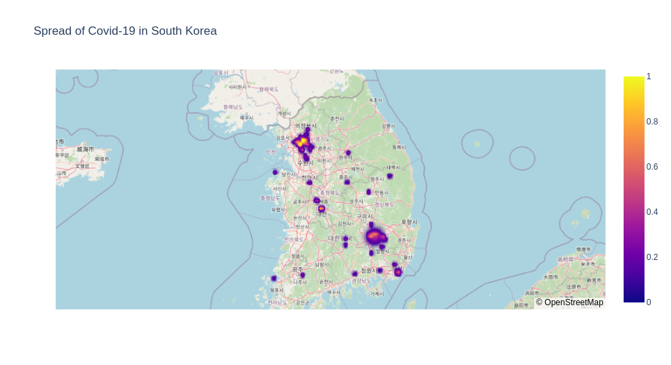
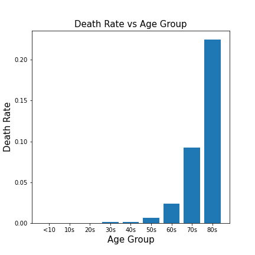
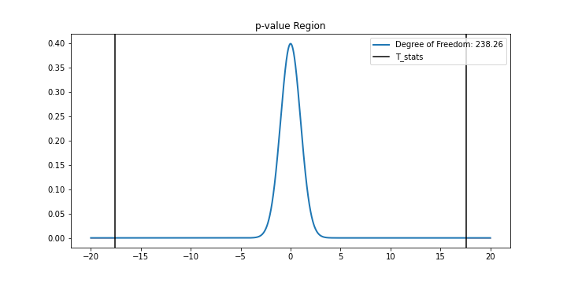
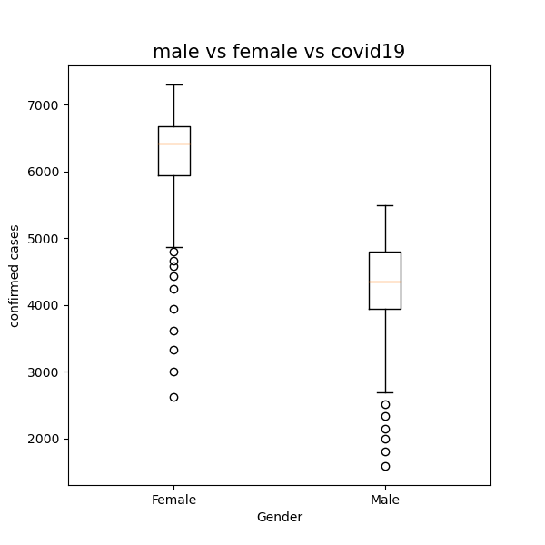
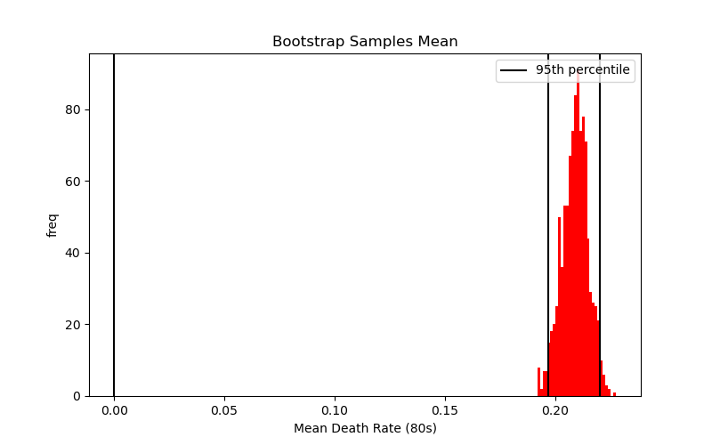
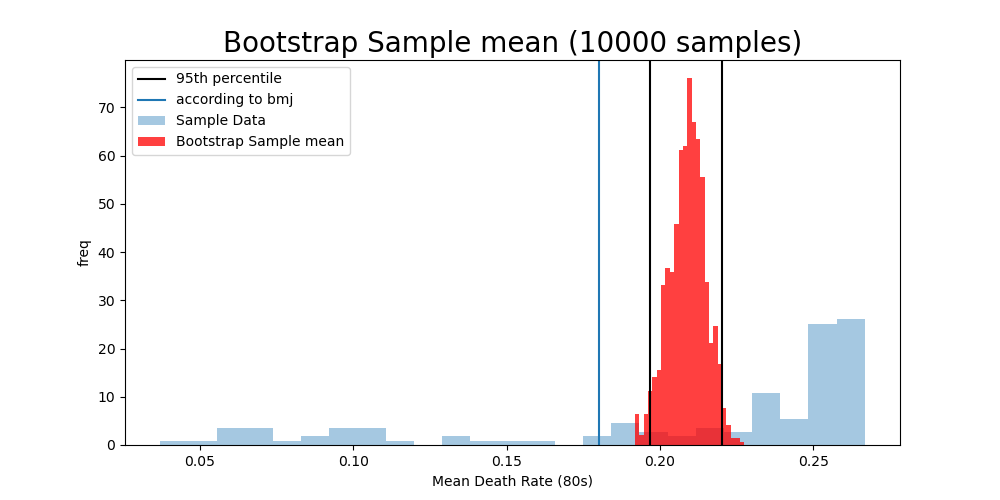
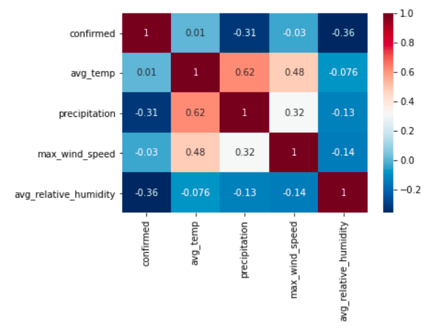
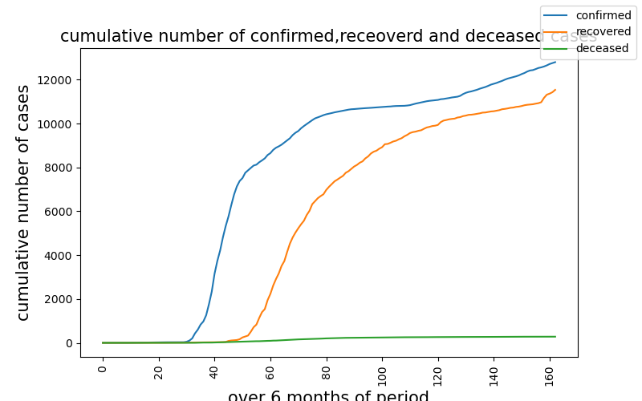
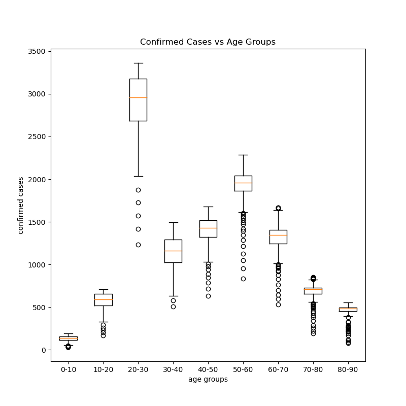
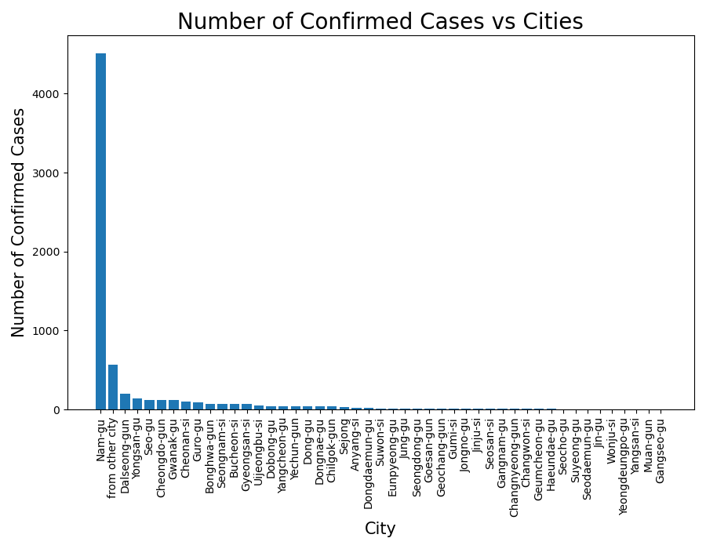

<p align="center">

</p>

# Spread of Covid-19 in South Korea

## Introduction  

The COVID-19 pandemic in South Korea is part of the worldwide pandemic of Covid-19 disease 2019 caused by SARS-CoV-2. The first case in South Korea was announced on 20 January 2020. The numbers of confirmed cases continuously increased on 19 February by 20, and on 20 February by 58 or 70, giving a total of 346 confirmed cases on 21 February 2020, according to the Korea Disease Control and Prevention Agency, with the sudden jump mostly attributed to "Patient 31" who participated in a gathering at a Shincheonji Church of Jesus the Temple of the Tabernacle of the Testimony church in Daegu. This study aims to address some of the controversial topics related to covid-19 using real world data.

The questions that this study will focus on are:

 * Does Covid-19 affect women and men Differently? If yes, how significant?
 * what age groups are most vulnerable? can we use those findings to predict future? If yes, how accurate?
 * what age group are most likely to contract the virus?
 * How likely to spread Covid-19 under different weather conditions?  
 
 ## Raw Data

The data on spread of Covid-19 in South Korea came from Korea Centers for Disease Control & Prevention (http://www.cdc.go.kr/index.es?sid=a2). Then, the data was modified and put it on Kaggle (https://www.kaggle.com/kimjihoo/coronavirusdataset) for study purpose. This is where the data for this project came from. All census data is included in the data folder. 

 ### Data Cleaning Workflow

1. The case data conatained information about more than 65 cities in South Korea, not including information about overseas and immigrants. Plan was to grab only information that needed to visualize the spread of Covid in South Korea. There were some null values that needed to taken care, and the data type of longitude and latitude was object. In order to use object data type in plotly, the change in data type was required from object to float 64. I created some new 2 columns and stored float longitude and latitude in them.

| lat_float         | long_float        |
|------------------:|-------------------|
|  37.538621|26.992652|
|37.482080|26.901384|
|37.508163|126.884387|
|37.546061|126.874209|
|37.679422|127.044374|

2. The gender data set was seperated into two small data sets for work purpose because both male and female were stored in raws rather than columns.

3. Data set age had to be grouped by different age groups. Then, I filtered out confirmed and deceased cases related to age group 80s. Those data columns were used to creat a new data column to determine death rate of each group. what I found was surprising.  


|age|confirmed|deceased|deathrate|
|-----|--------|-----|----------|
|0s|16107|0|0|
|10s|	68752	|0	|0.000000|
|20s|	345827|	0|	0.000000|
|30s|	137539	|194	|0.001411|
|40s	|168250	|295	|0.001753|
|50s	|230030	|1537	|0.006682|
|60s	|158505	|3743	|0.023614|
|70s	|82107	|7599	|0.092550|
|80s	|54086	|12136	|0.224383|


<p align="center">

</p>


4. The weather data set was grouped by different province in S.Korea, and decided to create a new data frame that includes average weather conditions for each province. Then, I decided to combine that new dataframe with average cases in each province. The table contains information about 17 provinces.

 |province|confirmed|	avg_temp|	precipitation|	max_wind_speed|	avg_relative_humidity|
 |-----|-------|------|--------|-----------|------|
 |Busan|156|15.16|1.9|6.4|62.8|
 |Chungcheongbuk-do|60|11.9|1.25|3.9|64.89|
 
 
## EDA Workflow

### Hypothesis Testing

1.  This study is meant to determine if Covid-19 affects women and men differently. I stated my null and alternative hypothesis below.
```
H0: Covid-19 affects on men and women are the same.
HA: Covid-19 affects on men and women are different.
```
2. First thing first, I decided to get a sense of covid-19 distribution within each gender group.  


<p align="center">

</p>

<p align="center">

</p>

3. The results are surpricing. There is a big different between each gender group, but wait... Is this enough information to confirm that the difference is significant? Since, mean and std can be calculated using given data, I decided to run a T-test on each gender group.
```
code  : stats.ttest_ind(male_cat.confirmed,female_cat.confirmed)
Result: Ttest_indResult(statistic=-17.481890764228474, pvalue=1.0831493925030636e-44).
```
4. As you can see, pvalue is significantly low in this case. That means we can reject the null hypothesis. In other word, Covid-19 affects men and women differently. But I wanted to visulaize T-statistic and see where significantly low pvalue lies.

<p align="center">

</p>


<p align="center">

</p>


5. **conclusion**: There is a clear difference between genders, and who is more likely contract the virus. WHY? some of my thoughts are a lot of women work in healthcare field and there are more likely to expose to the virus and contract it compare to men. I would love to do a study on what percentage of women in South Korea work in healthcare field.

### Bootstraping

1. In this study, I wanted to see how accurate I can predicted the future by using the given data. I was looking at the death rate related to each age group, and I was surprising to see the outcome. People fall into 80-90 age category, about 20% of them had passed away. 

2. Then, I decided run a bootsrap hypothesis test to determine death rate of people in 80s all around the world.

<p align="center">

</p>

3. By runing the bootsrap hypothesis test, I was able to state that I am 95% confident, death rate for people in 80s lies between .197 and .220. I googled to find out that my experimental data match with real time data. According to bmj (https://www.bmj.com/content/369/bmj.m1327), the actual death rate percentage of people in 80s is about 18%

<p align="center">

</p>

4. **conclusion**: I am kind of dissapointed to see the actual percentage does not lie between within my experimental confident interval. But there are reasons. One could be that this data is part of a time series which can be changed time to time. For example, when we first heard about covid, we were not that prepared and we barely new anything new about the desease. As the virus has been around almost two years, we had more time to be preapared and slow the spread and slow the death rate. That might be the reason why the actual data is different from the S.Korean data.

### Correlation

I wanted to see if there is a correlation between specific weather conditions and number of confirmed cases.

<p align="center">

</p>
  **conclusion**: I was actually hoping to find out that there is a relationship between average temperature in each province and confirmed cases because study has shown that virus spread through air. Surprisingly, I could not find anything, but precipitation is negatively correlated with number of confirmed cases. What does this mean? More rain, less confirmed cases. I assume that when there is no rain, people tend to limit outdoor activities which means they are less likely to get exposed to virus. Interesting!!!. The rain has come to rescue the world.

## More Graphs

<p align="center">

</p>


<p align="center">

</p>


<p align="center">

</p>
